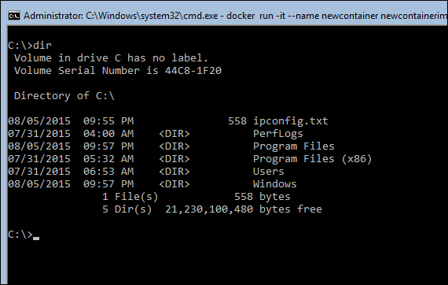
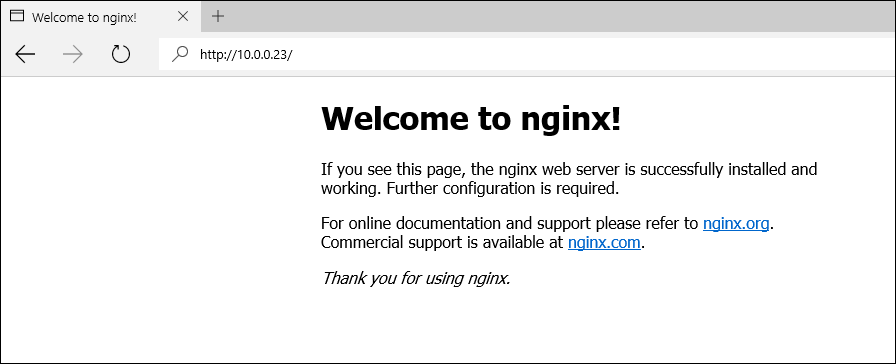

ms。ContentId:347fa279-d588-4094-90ec-8c2fc241f5b6
タイトル:Docker と Windows Server のコンテナーを管理します。

#クイック スタート:Windows Server のコンテナーと Docker

この記事は windows Docker を使用してコンテナーをサーバーの管理の基礎について説明します。
Windows Server のコンテナーとサーバーのコンテナーの Windows イメージを作成する、Windows Server のコンテナーおよびコンテナーのイメージの削除、および最後に、アプリケーションを Windows Server のコンテナーに展開する対象となるアイテムが含まれます。
このチュートリアルで得られた教訓では、Docker を使用して、Windows のサーバー コンテナの展開と管理の調査を開始するを有効にする必要があります。

ご質問があるでしょうか。
依頼、 [Windows のコンテナーのフォーラム](https://social.msdn.microsoft.com/Forums/en-US/home?forum=windowscontainers)。

> **注: ** PowerShell で作成された Windows コンテナーいない現在管理できます Docker と逆です。
> PowerShell では、コンテナーを作成するを参照してください。  [クイック スタート:Windows Server のコンテナーと PowerShell](./manage_powershell.md)。
> < br/>< br/> を詳細を知りたい場合 [読み取り、よく寄せられる質問](../about/faq.md#WhydoIhavetopickbetweenDockerandPowerShellforWindowsServerContainermanagement)。
> 

##前提条件

このチュートリアルを完了するのには、次の項目を適所に配置する必要があります。

*   Windows Server 2016 TP3 か、後で、Windows Server のコンテナーの機能を構成します。
    セットアップ ガイドを完了したら、これが Azure または HYPER-V で作成された VM です。
*   このシステムは、ネットワークに接続されていると、インターネットにアクセスすることである必要があります。

コンテナーの機能を構成する必要がある場合は、次のガイドを参照してください。 [Azure でのコンテナーのセットアップ](./azure_setup.md) または [HYPER-V のコンテナーのセットアップ](./container_setup.md)。

##Docker で基本的なコンテナーの管理

この最初の例は、作成および Windows Server のコンテナーと Docker での Windows サーバー コンテナーのイメージを削除するための基本事項について説明します。

Windows Server のコンテナーのホスト システムにログを通じてウォークを開始するには、Windows のコマンド プロンプトが表示されます。

!(media/cmd.png)

」と入力して、PowerShell セッションを開始します。 `powershell`。
プロンプトを変更するときに、PowerShell セッションであることがわかります `C:\directory>` で仮想ネットワーク アダプター `PS C:\directory>`。


```
C:\> powershell
Windows PowerShell
Copyright (C) 2015 Microsoft Corporation. All rights reserved.

PS C:\>

```


> このクイック スタートは、PowerShell コマンドを使用してファイアウォール ルールを管理して、ファイルのコピーなどのいくつかの手順を実行します。 ただし、Docker コマンドに注目が。
> PowerShell セッションからには、このチュートリアルを使用します。
> 

次に、システムでは、有効な IP アドレスを使用して、持っていることを確認します。 `ipconfig` 後で使用するのには、このアドレスを書き留めます。


```
ipconfig

Ethernet adapter Ethernet 3:

   Connection-specific DNS Suffix  . :
   IPv6 Address. . . . . . . . . . . : 2601:600:8f01:84eb::e
   IPv6 Address. . . . . . . . . . . : 2601:600:8f01:84eb:a8c1:a3e:96b7:ffcb
   Link-local IPv6 Address . . . . . : fe80::a8c1:a3e:96b7:ffcb%5
   IPv4 Address. . . . . . . . . . . : 192.168.1.25

```

使用せずに Azure の仮想マシンで作業している場合 `ipconfig` Azure の仮想マシンのパブリック IP アドレスを取得する必要があります。

!(media/newazure9.png)

###手順 1 - 新しいコンテナーを作成します。

Docker と Windows Server のコンテナーを作成する前に、名前または exsisitng サーバー コンテナーの Windows イメージの ID が必要です。

使用してに、コンテナーのホストに読み込まれるイメージがすべて表示するには `docker images` コマンドなど) を指定します。

'' PowerShell
docker イメージ

リポジトリ タグ イメージ ID には仮想サイズが作成されました。
windowsservercore 最新 9eca9231f4d4 30 時間前 9.613 GB
windowsservercore 10.0.10254.0 9eca9231f4d4 30 時間前 9.613 GB


```

Now, use `docker run` To create a new Windows Server Container. This command as seen below will instruct the Docker daemon to create a new container named ‘dockerdemo’ from the image ‘windowsservercore’ and open an interactive (-it) console session (cmd) with the container.

``` PowerShell
docker run -it --name dockerdemo windowsservercore cmd

```

コマンドの完了時に、処理するコンソール セッションで、コンテナーにします。

コンテナーでの作業は、仮想または物理コンピューターにインストールされているウィンドウの操作とほぼ同じです。
などのコマンドを実行することができます。 `ipconfig` コンテナー内の IP アドレスを返す `mkdir` 新しいディレクトリを作成するか、 `powershell` PowerShell セッションを開始します。
ファイルまたはフォルダーの作成などのコンテナーを変更してください。
たとえば、次のコマンドでは、コンテナーに関するネットワーク構成データを格納するファイルが作成されます。

'' PowerShell
ipconfig > c:\ipconfig.txt


```

You can read the contents of the file to ensure the command completed successfully. Notice that the IP address contained in the text file matches that of the container.

``` PowerShell
type c:\ipconfig.txt

Ethernet adapter vEthernet (Virtual Switch-94a3e12ad262b3059e08edc4d48fca3c8390e38c3b219023d4a0a4951883e658-0):

   Connection-specific DNS Suffix  . : 
   Link-local IPv6 Address . . . . . : fe80::cc1f:742:4126:9530%18
   IPv4 Address. . . . . . . . . . . : 172.16.0.2
   Subnet Mask . . . . . . . . . . . : 255.240.0.0
   Default Gateway . . . . . . . . . : 172.16.0.1

```

コンテナーを変更すると、これでは、バックアップを作成するコンテナーのホストのコンソール セッションに配置するコンソール セッションを停止するのには、次を実行します。

'' PowerShell
exit


```

Finally to see a list of containers on the container host use the `docker ps –a` command. Notice from the output that a container named 'dockerdemo' has been created.

``` PowerShell
docker ps -a

CONTAINER ID        IMAGE               COMMAND        CREATED             STATUS                     PORTS     NAMES
4f496dbb8048        windowsservercore   "cmd"          2 minutes ago       Exited (0) 2 minutes ago             dockerdemo

```


###手順 2 - 新しいコンテナーのイメージを作成します。

このコンテナーから、イメージを行うようになりましたことができます。
このイメージは、コンテナーのスナップショットのように動作し、再展開できます何度もします。

次のコマンド実行の新しいイメージを作成します。
このコマンドは、'newcontainerimage'、'deckerdemo' コンテナーに加えられたすべての変更に含まれるという名前の新しいイメージを作成するには、Docker エンジンに指示します。

'' PowerShell
docker コミット dockerdemo newcontainerimage


```

To see all images on the host, run `docker images`. Notice that a new image has been created with the name 'newcontainerimage'.

``` PowerShell
docker images

REPOSITORY          TAG                 IMAGE ID            CREATED             VIRTUAL SIZE
newcontainerimage   latest              4f8ebcf0a334        2 minutes ago       9.613 GB
windowsservercore   latest              9eca9231f4d4        30 hours ago        9.613 GB
windowsservercore   10.0.10254.0        9eca9231f4d4        30 hours ago        9.613 GB

```


###ステップ 3 - イメージから新しいコンテナーを作成します。

コンテナーのカスタム イメージがある場合は、これでは、'newcontainerimage' から '新しい' がコンテナーをという名前の新しいコンテナーを展開し、コンテナーに、対話型シェル セッションを開きます。

'' PowerShell
実行するには – docker その名前の新しいコンテナー newcontainerimage cmd


```

Take a look at the c:\ drive of this new container and notice that the ipconfig.txt file is present.



Exit the newly created container to return to the container hosts console session.

``` PowerShell
exit

```

ここでは、変更されたコンテナーから取得したイメージのすべての変更が含まれる説明しました。
次の例では、単純なファイルの変更でしたが、web サーバーなどのコンテナー内にソフトウェアをインストールした場合は、同じ適用されます。
これらのメソッドを使用して、カスタム イメージを作成できますが、アプリケーションの準備完了のコンテナーを展開します。

###手順 4.-コンテナーを削除して、イメージ

不要になった後に、コンテナーを削除するを使用するために必要な `docker rm` コマンドなど) を指定します。
次のコマンドでは、コンテナー名 '新しいコンテナー' が削除されます。

'' PowerShell
docker rm の新しいコンテナー


```
To remove container images when they are no longer needed use the `docker rmi` command. You cannot remove an image if it is referenced by an existing container.

The following command removes the container image named 'newcontainerimage'.
``` PowerShell
docker rmi newcontainerimage

Untagged: newcontainerimage:latest
Deleted: 4f8ebcf0a334601e75070a92294d993b0f182abb6f4c88740c75b05093e6acff

```


##コンテナー内の Web サーバーをホストします。

次の例では、Windows Server のコンテナーのより実用的な使用例を示します。
この演習では含まれている手順で Windows Server のコンテナー内でホストされる web アプリケーションを展開するために使用できる web サーバー コンテナーのイメージを作成する手順を説明します。

###ステップ 1 - Web サーバーのソフトウェアのダウンロード

Web コンテナーのイメージを作成する前に、サーバー ソフトウェアは、ダウンロードして、コンテナーのホストで事前設定する必要があります。
私たちに使用する、nginx この例については、Windows ソフトウェア。
**注意** この手順には、インターネットに接続するコンテナーのホストが必要です。
この手順を生成した場合、接続、または名前の解決エラーは、コンテナーのホストのネットワーク構成を確認します。

この例で使用されるディレクトリ構造を作成するコンテナーのホスト上には、次のコマンドを実行します。

'' PowerShell
mkdir c:\build\nginx\source


```

Run this command on the container host to download the nginx software to 'c:\nginx-1.9.3.zip'.

``` PowerShell
wget -uri 'http://nginx.org/download/nginx-1.9.3.zip' -OutFile "c:\nginx-1.9.3.zip"

```

最後に、次のコマンドでは、'C:\build\nginx\source' nginx ソフトウェアが抽出されます。

'' PowerShell
[アーカイブ-パス C:\nginx-1.9.3.zip-destinationpath C:\build\nginx\source の強制


```

### Step 2 - Create Web Server Image
In the previous example, you manually created, updated and captured a container image. This example will demonstrate an automated method for creating container images using a Dockerfile. Dockerfiles contain instructions that the Docker engine uses to build and modify a container, and then commit the container to a container image. 
For more information on dockerfiles, see [Dockerfile reference](https://docs.docker.com/reference/builder/).

Use the following command to create an empty dockerfile.

``` PowerShell
new-item -Type File c:\build\nginx\dockerfile

```

メモ帳で、dockerfile を開きます。


```
notepad.exe c:\build\nginx\dockerfile

```

コピーし、次のテキストをメモ帳を閉じる、ファイルの保存、メモ帳に貼り付けます。

'' PowerShell
Windowsservercore から
ラベルの説明 ="Windows nginx"ベンダー ="nginx"バージョン =「1.9.3」
ソース/nginx を追加します。


```

At this point the dockerfile will be in 'c:\build\nginx' and the nginx software extracted to 'c:\build\nginx\source'. 
You are now ready to build the web server container image based on the instructions in the dockerfile. To do this, run the following command on the container host.

``` PowerShell
docker build -t nginx_windows C:\build\nginx

```

このコマンドが、docker のエンジンにある dockerfile を使用するように指示します。 `C:\build\nginx` 'nginx_windows' をという名前のイメージを作成します。

出力は、次のようになります。

!(media/docker1.png)

完了したらを見て、イメージを使用してホストで、 `docker images` コマンドなど) を指定します。
'Nginx_windows' という名前の新しいイメージを表示する必要があります。
'' PowerShell
docker イメージ

リポジトリ タグ イメージ ID には仮想サイズが作成されました。

nginx_windows 最新 d792268338d0 5 秒前 9.613 GB
windowsservercore 10.0.10254.0 9eca9231f4d4 35 時間前 9.613 GB
windowsservercore 最新 9eca9231f4d4 35 時間前 9.613 GB


```

### Step 3 – Configure Networking for Container Application
Because you will be hosting a website inside of a container a few networking related configurations need to be made. First a firewall rule needs to be created on the container host that will allow access to the website. In this example we will be accessing the site through port 80. Run the following script to create this firewall rule. This script can be copied into the VM. 

``` powershell
if (!(Get-NetFirewallRule | where {$_.Name -eq "TCP80"})) {
    New-NetFirewallRule -Name "TCP80" -DisplayName "HTTP on TCP/80" -Protocol tcp -LocalPort 80 -Action Allow -Enabled True
}

```

次に Azure から作業しているし、仮想マシンのエンドポイントにまだ作成していない場合には、ここで作成する必要があります。
Azure VM のエンドポイントの詳細については、この記事を参照してください。 [Azure の仮想マシンのエンドポイントをセットアップします。](https://azure.microsoft.com/en-us/documentation/articles/virtual-machines-set-up-endpoints/)。

###手順 4 - Web サーバーの準備完了のコンテナーを展開します。

'Nginx_windows' に基づく Windows Server のコンテナーを展開するのには、コンテナーは、次のコマンドを実行します。
'Nginxcontainer' という名前の新しいコンテナーを作成、コンテナーでコンソール セッションを開始します。
このコマンドの – p 80:80 部分では、コンテナーのポート 80 へのホスト上のポート 80 の間のポート マッピングを作成します。

'' powershell
実行 - docker その名前 nginxcontainer-p 80:80 nginx_windows cmd


```
Once working inside the container, the nginx web server can be started and web content staged. To start the nginx web server, change to the nginx installation directory.

``` powershell
cd c:\nginx\nginx-1.9.3

```

Nginx の web サーバーを起動します。
'' powershell
nginx を開始します。


```
### Step 5 – Access the Container Hosted Website

With the web server container created, you can now checkout the application hosted in the container. To do so, open up a browser on different machine and enter `http://containerhost-ipaddress`. Notice here that you will be browsing to the IP Address of the Container Host and not the container itself. If you are working from an Azure Virtual Machine this will be the public IP address or Cloud Service name. 

If everything has been correctly configured, you will see the nginx welcome page.



At this point, feel free to update the website. Copy in your own sample website, or run the following command in the container to replace the nginx welcome page with a ‘Hello World’ web page.

```powershell
powershell wget -uri 'https://raw.githubusercontent.com/Microsoft/Virtualization-Documentation/master/doc-site/virtualization/windowscontainers/quick_start/SampleFiles/index.html' -OutFile "C:\nginx\nginx-1.9.3\html\index.html"

```

Web サイトが更新された後の移動します。 `http://containerhost-ipaddress`。

!(media/hello.png)

> **注: ** 使用して (がリッスンするポートを変更するか、コンテナーにリモート接続するなど) Docker デーモンの設定を変更するには、コンテナーにファイル"C:\ProgramData\docker\runDockerDaemon.cmd"を編集する必要があります、および PowerShell を使用したサービスを再起動する必要がある場合。 `Restart-Service docker`。
> 

##ビデオ チュートリアル

<iframe src="https://channel9.msdn.com/Blogs/containers/Quick-Start-Deploying-and-Managing-Windows-Server-Containers-with-Docker/player" width="800" height="450" allowFullScreen="true" frameBorder="0" scrolling="no" caps_internal_Id="cf847b1f-7a69-4ace-b7f2-643f4b26d875" />

##次の手順

コンテナーを設定し、ツールの概要がある場合は、これでは、コンテナー化、独自のアプリの構築を参照してください。

ただし、これは、 **プレビュー** バグがあるし、多数の進行中の作業があります。
[このページ](../about/work_in_progress.md) 既知の問題の多くが含まれます。

いくつかの既知の Docker コマンド、注意してください。 [機能しません。](../about/work_in_progress.md#DockermanagementDockercommandsthatdontworkwithWindowsServerContainers) いくつかのみです。 [部分的に作業します。](../about/work_in_progress.md#DockermanagementDockercommandsthatpartiallyworkwithWindowsServerContainers)

監視も、 [フォーラム](https://social.msdn.microsoft.com/Forums/en-US/home?forum=windowscontainers) 非常に密接にします。

上にあるも作成済みのサンプル [GitHub](https://github.com/Microsoft/Virtualization-Documentation/tree/master/windows-server-container-samples)。

-----------------------------------
[Back to Container Home](../containers_welcome.md)   
[Known Issues for Current Release](../about/work_in_progress.md)


